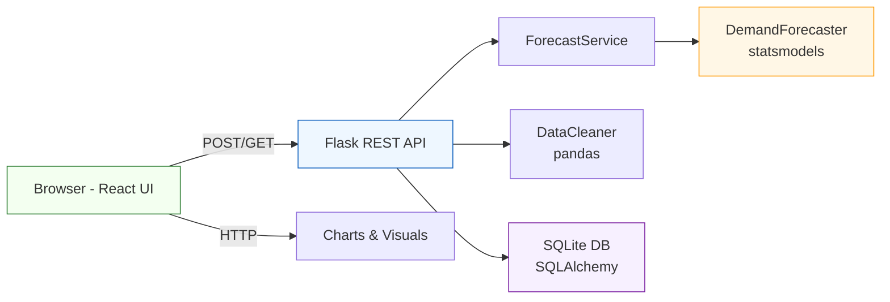
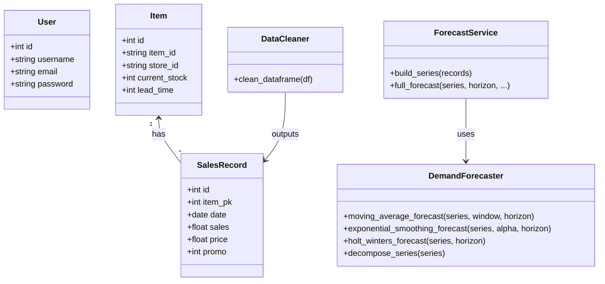
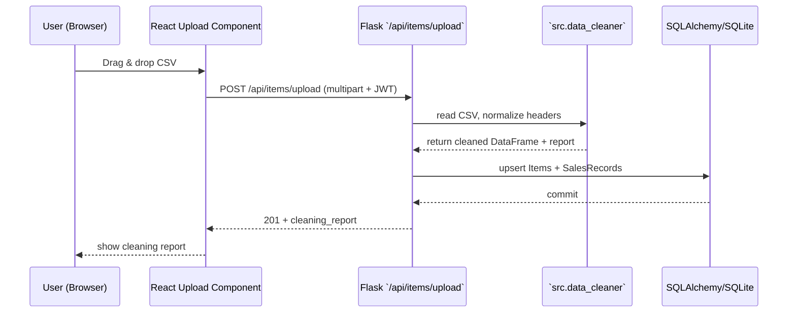
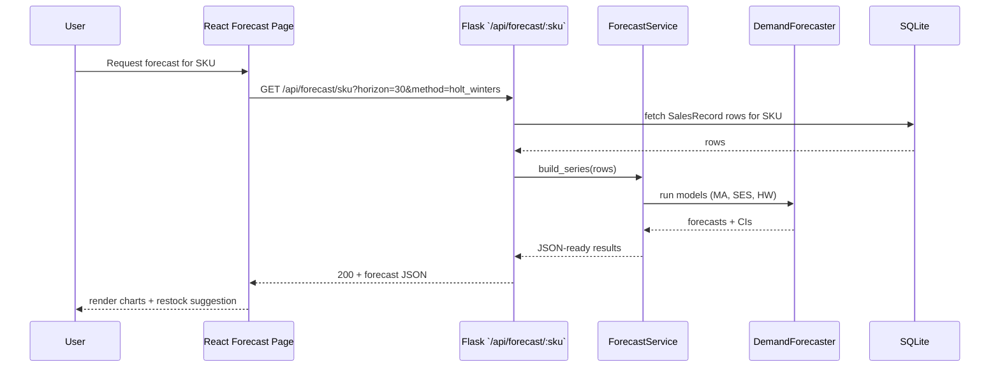

# Invenza — Inventory Demand Forecasting Tool

A full-stack SaaS-style application for SKU-level demand forecasting, seasonality analysis, and intelligent restocking recommendations.

**Tech Stack:** Flask · SQLite · Pandas · Statsmodels · React (Vite) · Recharts · JWT

---

## Project Structure

```
inventory-app/
├── backend/
│   ├── app.py                  # Flask factory
│   ├── config.py               # App + model config
│   ├── models.py               # SQLAlchemy models (User, Item, SalesRecord)
│   ├── requirements.txt
│   ├── .env
│   ├── routes/
│   │   ├── auth.py             # POST /api/auth/login|signup
│   │   ├── items.py            # CRUD + CSV upload
│   │   ├── forecast.py         # GET /api/forecast/<sku>
│   │   ├── restock.py          # GET /api/restock
│   │   └── dashboard.py        # GET /api/dashboard
│   └── src/
│       ├── data_cleaner.py     # Cleaning pipeline (your original)
│       ├── forecasting_engine.py # MA, SES, Holt-Winters (your original)
│       ├── forecast_service.py  # Service layer (bridge)
│       ├── eda.py              # EDA utilities
│       └── visualizer.py       # Plot helpers
│
└── frontend/
    ├── index.html
    ├── vite.config.js
    ├── package.json
    └── src/
        ├── App.jsx
        ├── main.jsx
        ├── index.css            # Design system (pista green + beige)
        ├── context/
        │   └── AuthContext.jsx  # JWT auth state
        ├── services/
        │   └── api.js           # Axios + JWT interceptors
        ├── components/
        │   ├── ProtectedRoute.jsx
        │   └── layout/
        │       └── Sidebar.jsx
        └── pages/
            ├── Login.jsx
            ├── Signup.jsx
            ├── Dashboard.jsx    # Stats + trend chart
            ├── Upload.jsx       # Drag-and-drop CSV
            ├── Items.jsx        # CRUD + pagination
            ├── Forecast.jsx     # All models + comparison
            ├── Decompose.jsx    # Trend/Seasonal/Residual
            └── Restock.jsx      # Recommendations + bar chart
```

---

## Setup Instructions

### Prerequisites
- Python 3.9+
- Node.js 18+

### 1. Backend

```bash
cd backend

# Create virtual environment
python -m venv venv
source venv/bin/activate         # Windows: venv\Scripts\activate

# Install dependencies
pip install -r requirements.txt

# Configure environment (edit .env)
cp .env .env.local

# Run the Flask server
python app.py
# → http://localhost:5000
```

### 2. Frontend

```bash
cd frontend

# Install packages
npm install

# Run Vite dev server
npm run dev
# → http://localhost:5173
```

### 3. Load Sample Data

1. Open http://localhost:5173 → Sign up
2. Go to **Upload** page
3. Drag `retail_sales_2023_small.csv` onto the dropzone
4. Click **Upload & Process**

---

## API Endpoints

### Auth
| Method | Endpoint          | Description        |
|--------|-------------------|--------------------|
| POST   | /api/auth/signup  | Register           |
| POST   | /api/auth/login   | Login, get JWT     |

### Items
| Method | Endpoint              | Description        |
|--------|-----------------------|--------------------|
| POST   | /api/items/upload     | Upload CSV         |
| GET    | /api/items            | List all items     |
| GET    | /api/items/:id        | Item + history     |
| PUT    | /api/items/:id        | Update stock/lead  |
| DELETE | /api/items/:id        | Delete item        |

### Forecast
| Method | Endpoint                  | Description               |
|--------|---------------------------|---------------------------|
| GET    | /api/forecast/:sku        | Full forecast + metrics   |
| GET    | /api/forecast/decompose/:sku | Decomposition          |
| GET    | /api/forecast/:sku/export | Download forecast CSV     |

**Query params:** `method`, `horizon`, `seasonal_period`, `store_id`, `current_stock`, `lead_time`

### Dashboard & Restock
| Method | Endpoint          | Description                |
|--------|-------------------|----------------------------|
| GET    | /api/dashboard    | Stats, trend chart, SKUs   |
| GET    | /api/restock      | All SKU restock recs       |

---

## Forecasting Models

| Model              | Description                                   |
|--------------------|-----------------------------------------------|
| Moving Average     | Rolling mean forecast, flat projection        |
| Simple Exp. Smoothing | Weighted recent average, α auto-optimised |
| Holt-Winters       | Trend + weekly seasonality (primary model)    |

All models output: forecast, 95% CI, MAE, RMSE, MAPE

---

## Restocking Logic

```
Safety Stock  = 1.2 × Forecasted Demand (30 days)
Reorder Point = Safety Stock − Current Stock
Alert         = Days of Stock < Lead Time
```

---

## Sample CSV Format

```csv
date,store_id,item_id,sales,price,promo,weekday,month
2023-01-01,store_1,item_1,41,21.3,0,6,1
2023-01-02,store_1,item_1,48,21.3,0,0,1
2023-01-01,store_1,item_2,33,15.0,1,6,1
```

Required columns: `date`, `item_id`, `sales`
Optional: `store_id`, `price`, `promo`, `weekday`, `month`

---

## Notes on Your Original Files

The following files were **reused without modification**:
- `src/data_cleaner.py` — full 8-step pipeline (standardise → type cast → nulls → dupes → negatives → IQR cap → fill dates → sort)
- `src/forecasting_engine.py` — `DemandForecaster` class with all methods
- `src/eda.py` — EDA chart generation
- `src/visualizer.py` — Matplotlib dashboard plots

---

## Architecture, End-to-End Flow, and UML Diagrams

This section documents the full request-to-response flow, the major components, the data model, and UML diagrams (class and sequence) so you — or other developers — can quickly understand, maintain, and extend the system.

### High-level Architecture

- Frontend: React (Vite) SPA running in browser. Handles user auth, CSV upload, visualisation, and interacting with forecast endpoints.
- Backend: Flask app exposing a small REST API surface with JWT-based auth. Responsibilities: validation, cleaning, persistence, model orchestration, CSV export.
- Data: SQLite (development) via SQLAlchemy models. Time-series stored as daily `SalesRecord` rows linked to `Item`.
- Models: Pandas/NumPy for data manipulation, `statsmodels` for SES/Holt-Winters forecasting.

### End-to-end Upload Flow 

1. User navigates to the Upload page and drags/drops a CSV.
2. Frontend performs a client-side basic validation (file type/size) and posts multipart/form-data to `POST /api/items/upload` with the JWT bearer token.
3. Backend `routes/items.py` receives the file and reads it using BOM-safe encoding (`utf-8-sig`).
4. CSV header normalisation is performed (`lower()`, `strip()`, spaces → underscores) to accept a wide range of user files.
5. The cleaning pipeline (`src/data_cleaner.py`) runs the 8-step process: standardise, cast, handle missing, combine duplicates, clip negatives, cap outliers, fill missing days, sort.
6. The cleaned DataFrame is upserted into `Item` and `SalesRecord` tables. NaNs and numpy scalars are coerced to Python `None`/native types before DB insertion to avoid type errors.
7. Backend returns a cleaning report JSON with original/final shapes and step messages.
8. Frontend displays the cleaning report and processed results; items are available in the Items page and forecasts can be run.

### End-to-end Forecast Flow 

1. User requests a forecast (Forecast page): enters `item_id`, chooses `method`, `horizon`, optionally `current_stock` and `lead_time`.
2. Frontend calls `GET /api/forecast/:sku` with query params and JWT bearer token.
3. Backend resolves the `Item`, fetches historical `SalesRecord` rows (ordered by date) and converts them into a daily `pd.Series` (resampled to fill missing dates with 0).
4. `ForecastService` calls `DemandForecaster` to compute MA, SES, Holt-Winters forecasts and confidence intervals, plus evaluation metrics on test split.
5. Forecast results are converted into JSON-friendly lists of `{date, value}`; numpy scalar types are converted to native Python types to ensure JSON serialization.
6. Backend also computes simple restocking recommendations from the primary forecast and returns the combined JSON payload.
7. Frontend visualises historical and forecast lines with 95% CI shaded area and shows restock suggestions.

### Component Diagram (Mermaid)



### Class Diagram (Mermaid)



### Sequence Diagram — Upload (Mermaid)



### Sequence Diagram — Forecast (Mermaid)



### Data Flow / Types

- Input CSV → DataFrame with columns (date, store_id, item_id, sales, ...)
- Cleaned DataFrame → rows persisted as `SalesRecord` (date, sales, price, promo,...)
- Resampled Series (daily) → model inputs
- Model outputs → arrays of (date, value) for charting and CSV export
