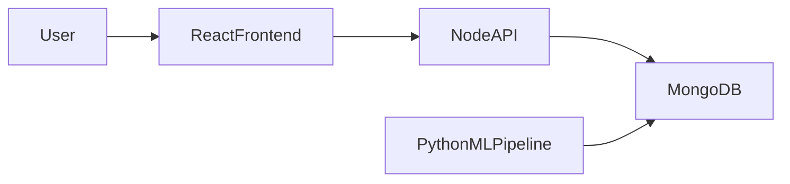
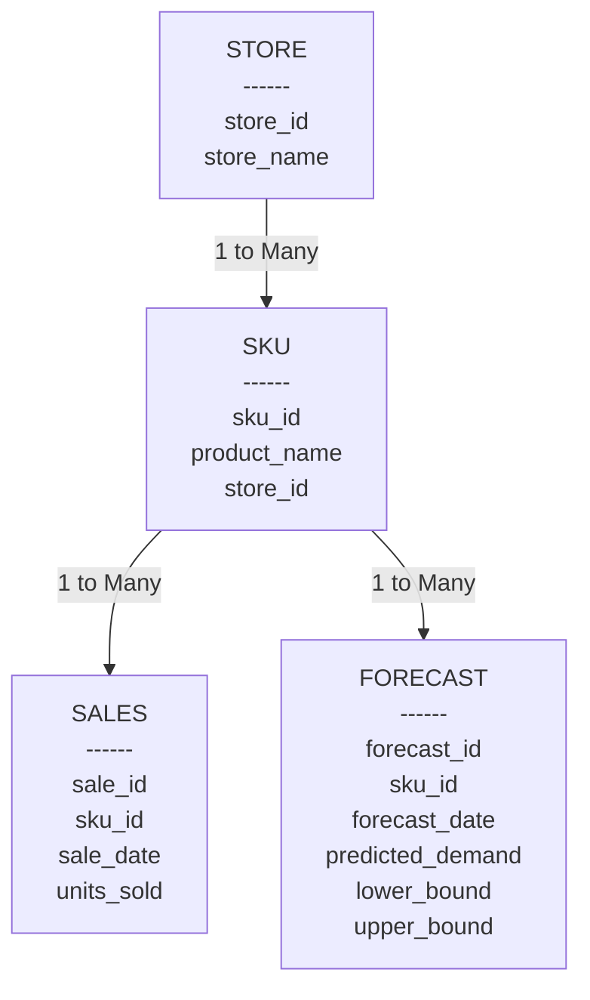
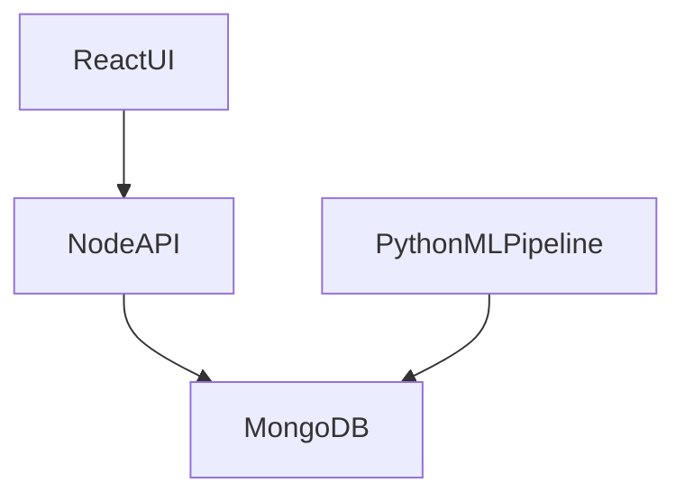
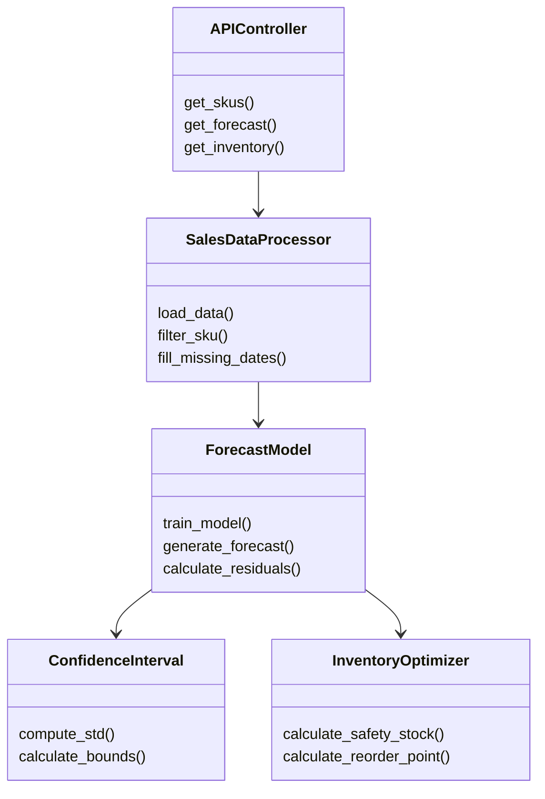
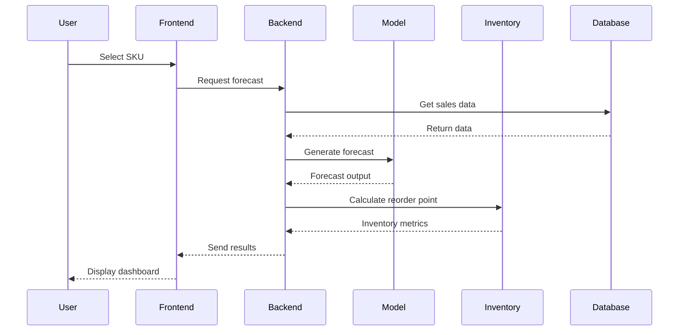

# Inventory_Demand_Forecasting_Tool
Deployed Link - https://inventory-demand-forecasting-tool-1.onrender.com

#  Invenza  
## Risk-Aware Inventory Intelligence Engine

An interpretable SKU-level demand forecasting and inventory optimization system for SMB retailers using structured time-series modeling and uncertainty quantification.

---

#  1. Problem Statement

## Problem Title  
Inventory Demand Forecasting for SMB Retailers

## Problem Description  
Small and medium businesses struggle with accurate demand forecasting, leading to overstocking, stockouts, and inefficient inventory planning. Most rely on spreadsheets that fail to capture seasonality, trends, and demand variability.

## Target Users  
- SMB Retailers  
- Inventory Managers  
- E-commerce Store Owners  

## Existing Gaps  
- No structured time-series modeling  
- No SKU-level forecasting  
=- No automated restocking logic  

---

#  2. Problem Understanding & Approach

## Root Cause Analysis
- Demand fluctuates weekly and seasonally  
- Manual forecasting ignores variability  
- Inventory planning is reactive  
- No probabilistic decision-making  

## Solution Strategy
- Detect weekly seasonality  
- Apply Holt-Winters forecasting  
- Compute 95% confidence intervals  
- Convert forecasts into restocking recommendations  

---

#  3. Proposed Solution

## Solution Overview
Invenza predicts SKU-level demand and generates safety-stock-aware restocking recommendations.

## Core Idea
Forecast demand + quantify uncertainty + optimize inventory decisions.

## Key Features
- SKU-level demand forecasting  
- Weekly seasonality modeling  
- 30-day prediction  
- 95% confidence interval  
- Safety stock calculation  
- Reorder point recommendation  
- Interactive dashboard  

---

#  4. System Architecture

## High-Level Architecture

## Architecture Description
1. Python Data Pipeline loads CSV and calculates Holt-Winters forecast.
2. Python Pipeline pushes historical and forecast data to MongoDB via NodeAPI.
3. User selects SKU on the React Frontend.
4. Frontend requests forecast from NodeAPI.
5. NodeAPI retrieves data from MongoDB and serves it to the client.
6. Dashboard visualizes results (Total Demand, Safety Stock, Reorder Point).

---

#  5. Database Design

## ER Diagram

---

#  6. UML Diagrams

## Component Diagram

---

## Class Diagram

## Sequence Diagram

---

#  7. Dataset Selected

## Dataset Name  
Store Item Demand Forecasting Dataset

## Source  
Kaggle

## Data Type  
Daily SKU-level retail demand data

## Selection Reason  
- Clean structure  
- Minimal null values  
- Strong weekly seasonality  
- Perfect for time-series modeling  
- Aligns with SKU-level forecasting  

## Preprocessing Steps  
- Selected 1 store  
- Selected 6 representative SKUs  
- Extracted 1 year of data  
- Sorted by date  
- Filled missing values  

---

#  8. Model Selected

## Model Name  
Holt-Winters Exponential Smoothing

## Selection Reason  
- Captures trend + seasonality  
- Interpretable  
- Lightweight  
- Suitable for SMB-scale data  

## Alternatives Considered  
- LSTM (rejected: small per-SKU data & low interpretability)  
- Prophet (rejected: complexity within 24-hour timeline)  

## Evaluation Metrics  
- Mean Absolute Percentage Error (MAPE)  
- Residual Standard Deviation  

---

#  9. Technology Stack

Frontend: React + Vite (Recharts)  
Backend API: Node.js (Express, Mongoose)  
Database: MongoDB  
ML Pipeline: Python (statsmodels, pandas, numpy)  
Deployment: Render + Vercel  

---

#  10. API Endpoints

- GET /api/skus (Retrieve all SKUs)
- GET /api/skus?sku_id={sku_id} (Retrieve data for a specific SKU)
- POST /api/skus (Push calculated forecast data into DB)

---

#  11. End-to-End Workflow

1. User selects SKU  
2. Backend retrieves historical data  
3. Weekly seasonality modeled  
4. Holt-Winters forecasting applied  
5. 30-day forecast generated  
6. Confidence interval computed  
7. Safety stock calculated  
8. Reorder point generated  
9. Results displayed on dashboard  

---

#  12. Future Scope

Short-Term:
- SKU volatility classification  
- Multi-store modeling  

Long-Term:
- Promotion-aware forecasting  
- Hierarchical category forecasting  
- Real-time demand streaming  

---

#  13. Known Limitations

- Assumes historical patterns persist  
- Does not include promotional features  
- No external regressors  

---

#  14. Impact

- Reduces stockouts  
- Reduces overstocking  
- Improves inventory planning  
- Enables data-driven decision making  
